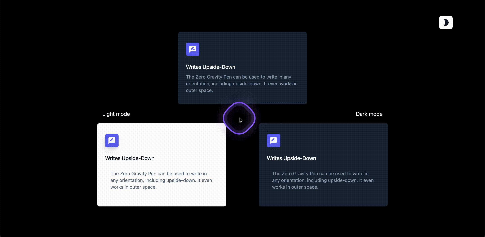

# Tailwind Saga

A brief description of what this project does 

This project/repo dedicate to learn and follow the standardization based on standard and the official documentation;

 by following though:
 ## core Concept

Utility-First Fundamentals

  - Overview
  - Why not just use inline styles? 
  - Maintainability concerns

Handling Hover, Focus, and Other States

  - Pseudo-classes
     - Hover, focus, and active
     - First, last, add, and even
     - Form states
     - Styling based on parent state
     - Styling based on sibling state

  - Pseudo-elements
     - Hover, focus, and active
     - First, last, add, and even
     - Before and after
     - Placeholder text
     - File input buttons
     - List markers
     - Highlighted text
     - First-line and first-letter
     - Dialog backdrops

  - Media and feature queries
     - Responsive breakpoints
     - Prefers color scheme
     - Prefers reduced motion
     - Prefers contrast
     - Viewport orientation
     - Supports rules

  - Attribute selectors
     - ARIA states
     - Data attributes
     - RTL support
     - Open/closed state

  - Custom modifiers
     - Using arbitrary variants
     - Creating a plugin

  - Advanced topics
     - Using with your own classes
     - Ordering stacked modifiers

  - Appendix
     - Pseudo-class reference

Responsive Design

  - Working mobile-first
     - Targeting mobile screens
     - Targeting a breakpoint range
     - Targeting a single breakpoint
  - Using custom breakpoints
     - Customizing your theme
     - Arbitrary values

Dark Mode

  - Basic usage
  - Toggling dark mode manually
     - Supporting system preference and manual selection
     - Customizing the class name

Reusing Styles

  - Loops
  - Extracting components and partials
     - Compared to CSS abstractions
  - Extracting classes with @apply
     - Avoiding premature abstraction

Adding Custom Styles

  - Customizing your theme
  - Using arbitrary values
     - Arbitrary properties
     - Arbitrary variants
     - Handling whitespace
     - Resolving ambiguities
  - Using CSS and @layer
     - Adding base styles
     - Adding component classes
     - Adding custom utilities
     - Using modifiers with custom CSS
     - Removing unused custom CSS
     - Using multiple CSS files
     - Layers and per-component CSS
  - Writing plugins

Functions & Directives

  - Directives
     - @tailwind
     - @layer
     - @apply
     - @config
  - Functions
     - theme()
     - screen()

## Preview
This is actually some of them more technical and can only be clearer by looking at the code, comment, & commit but here's some a quick preview.

> States Handling

> Dark mode

> Responsive

> Live Preview 🚀
> - [Utility-First Fundamentals](https://utility-first-fundamentals-tailwind-saga.vercel.app)
> - [Hover, Focus, and Other States](https://state-tailwind-saga.vercel.app)
> - [Responsive Design](https://responsive-design-tailwind-saga.vercel.app)
> - [Dark Mode](https://dark-mode-tailwind-saga.netlify.app)
> - [Reusing Styles](https://reusing-styles-tailwind-saga.netlify.app)
> - [Adding Custom Styles](https://custom-style-tailwind-saga.netlify.app)

##### _# [Starter Pack](/starter)_
I provide the [starter pack](/starter) for whoever want to learn, read more to get start.

_Made with ❤️‍🔥 TC_
